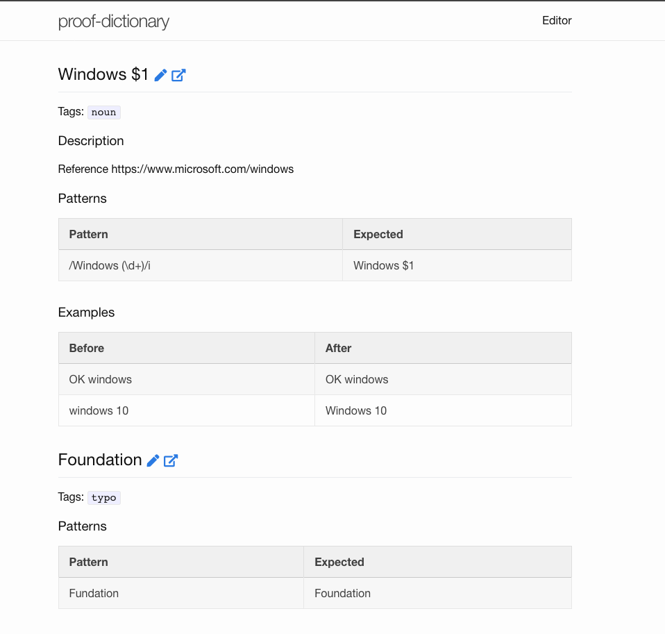

The Usage navigate that create your Dictionary and use it.

## 0. Requirements

- [GitHub](https://github.com/) account
- [Node.js](http://nodejs.org/)

## 1. Fork Dictionary repository

1. Visit [proofdict/proof-dictionary](https://github.com/proofdict/proof-dictionary "proofdict/proof-dictionary")
2. Click "Fork" button

## 2. Setting

1. Open "Setting" on your fork repository

2. Go to "GitHub Pages" section
    1. Select "master branch"
    2. Click "Save"
    

3. Open your GitHub pages

For example. your GitHub account name is `azu`.
You should open <https://azu.github.io/proof-dictionary/>.

Finally, You can see own dictionary!

## FAQ

### Q. GitHub pages is blank

At first time, GitHub Pages is not built yet.
You should edit some file like `README.md` and GitHub build pages.
