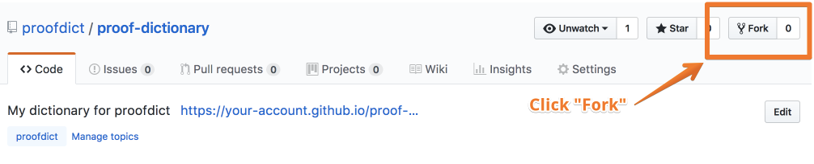
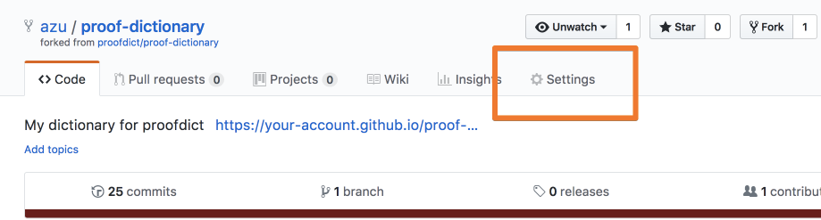
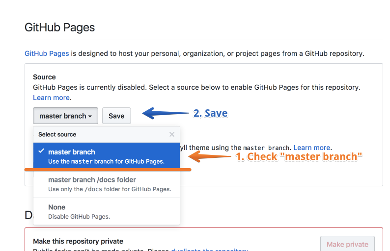
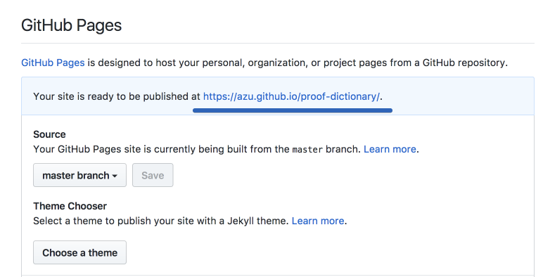

# Usage

## Fork Dictionary repository

1. Visit [proofdict/proof-dictionary](https://github.com/proofdict/proof-dictionary "proofdict/proof-dictionary")
2. Click "Fork" button

## Setting

1. Open "Setting" on your fork repository

2. See "GitHub Pages" section
    1. Check "master branch"
    2. Click "Save"
    

3. Open your GitHub pages

For example. your account name is `smith`.
You can open `https://smith.github.io/azu/proof-dictionary`.

